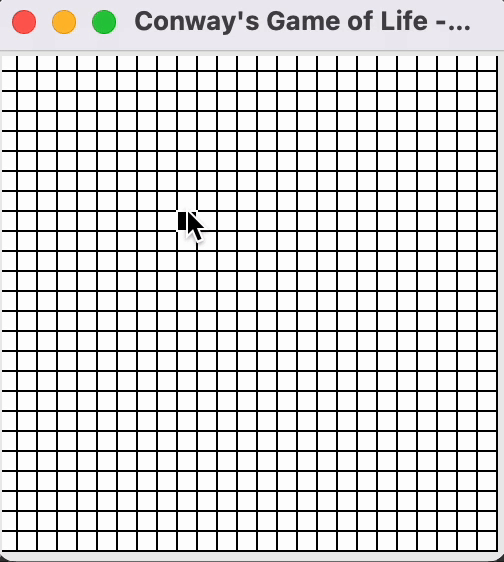

# Conway's Game of Life

My implementation of the Conway's Game of Life.
The game was fully implemented in Python.

## Installing:
Just clone this repository into a directory:
```
~ % mkdirs foo/bar
~ % cd foo/bar
foo/bar % git clone https://github.com/das-dias/conway.git
```
In order to run the game just switch to the directory and run the python call on the main of the program:
```
foo/bar/conway % python conway/conway/main.py
```
## How to Use It:
Calling for help on the program:
```
foo/bar/conway % python conway/conway/main.py -h
```

Checking the possibilities:
```
usage: main.py [-h] [-g GRIDSIZE] [-c CELLSIZE] [-s SPEED] [--random] [-w WRITE] [-r READ]

Conway's Game of Life by Diogo André

optional arguments:
  -h, --help            show this help message and exit
  -g GRIDSIZE, --grid-size GRIDSIZE
                        Size of the grid
  -c CELLSIZE, --cell-size- CELLSIZE
                        Size of each cell in the GUI
  -s SPEED, --speed SPEED
                        Number of computed generations per second
  --random              Randomize the initialization of the cell grid
  -w WRITE, --write WRITE
                        Write the grid to a file
  -r READ, --read READ  Read the grid from a file
```

Running the game with an initial board of 25x25 cells:
```
python conway/conway/main.py -g 25
```

# Button Usage:

**Left Mouse Button**: Select the alive cells in the first generation.

**Right Mouse**: Run a single generation (single game step) of the cell evolution.

**Mouse Scroll Click (Button 3)**: Automatically run all the generations of the game until no change happens.

## Example (with animated GIF):

## Example Console Output:
```
2022-05-08 11:13:11.292 | INFO     | __main__:main:7 - Conway's Game of Life by Diogo André
2022-05-08 11:17:17.958 | INFO     | __main__:main:29 - Maximum generation: 21
```